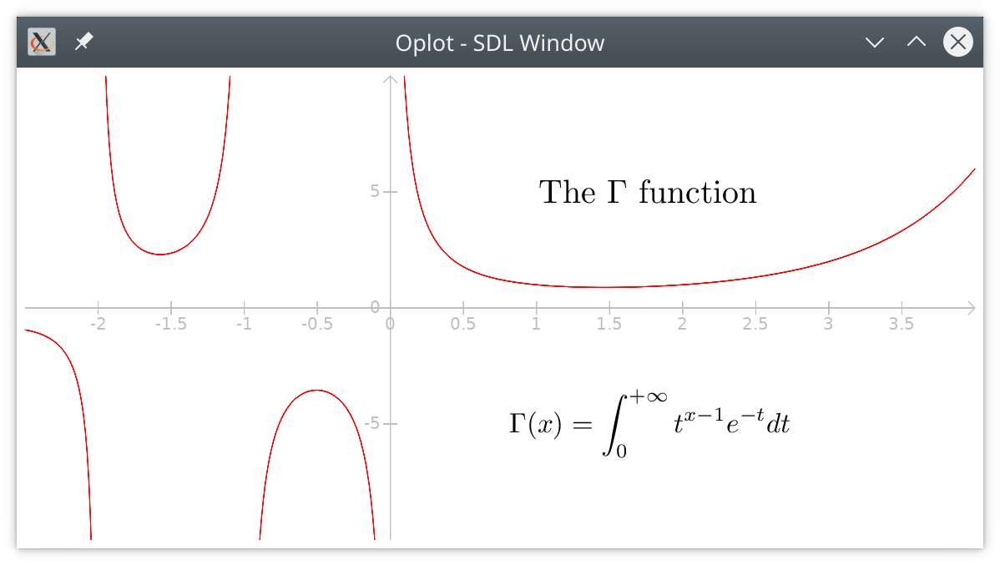
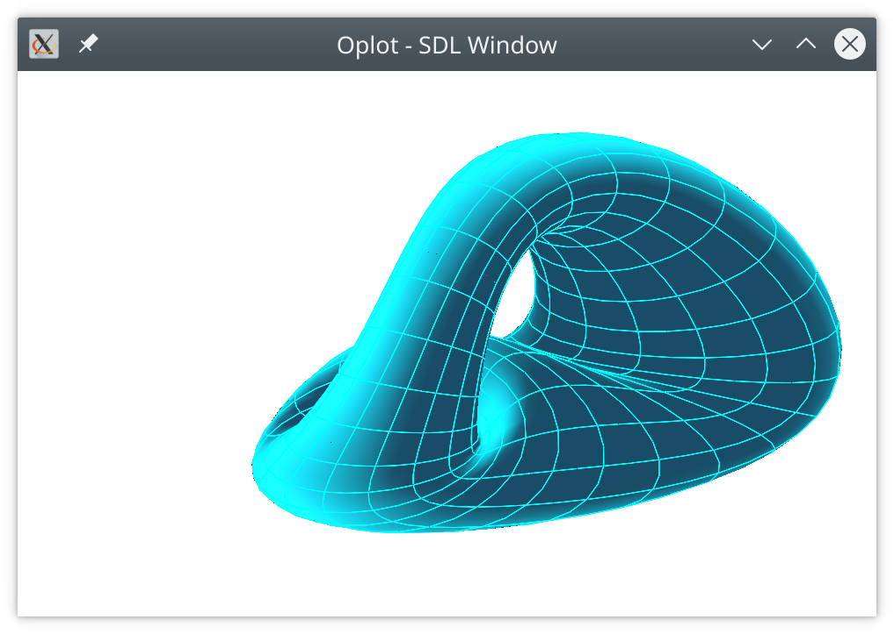

# Oplot

Mathematical plotting library for ocaml

| 2D plot and LaTeX |  3D surface |
|-----|-----|
||  |

+ 2D plots
  + function `y = f(x)`
  + parametric curves
  + can use mathematical functions from other libraries like `gsl`
  + can use LaTeX to display text and formulas
  + animations
  + Matrix or grid display
  + ...

+ 3D plots
  + parametric surfaces
  + 3D graphs `z = f(x,y)`
  + interactive 3D rotation and zoom
  + ...

+ Many renderers
  + GPU graphics (opengl/sdl)
  + Graphics package
  + high quality vector graphics in EPS or PDF files
  + xfig files
  + image screenshots

## Documentation

[Examples and API documentation](https://sanette.github.io/oplot/oplot/Oplot/index.html).

## GUI

An official standalone GUI for `oplot.0.72`:
[goplot](https://sanette.github.io/goplot/)

## Examples

The `top` directory contains examples that can be run from the ocaml
toplevel. See the [README](top/README.md) file.

## Install version >= 0.80

The current version does not require `lablgl`, but instead you should install `tgls` and `gl-legacy`:


```bash
opam install tgls
opam pin https://github.com/sanette/gl-legacy.git
opam pin https://github.com/sanette/oplot.git
```

## Install v 0.72

* `oplot<0.80` requires `lablgl`. If you have any trouble with this, try [this one.](https://github.com/sanette/lablgl-lib/tree/master?tab=readme-ov-file#how-to-use-this-one-instead-of-the-original-lablgl):

```
opam pin add https://github.com/sanette/lablgl-lib.git
opam install lablgl.1.07-lib
opam install oplot.0.72
```

## Requirements

* For PDF output you need to install the `fig2dev` system package.

* For LaTeX display you need a working LaTeX installation; for
instance install the `texlive` system package.

* For using the Gnu Scientific Library, install the `gsl` opam package:
```
opam install gsl
```

* For rendering via the OCaml Graphics library (currently not
recommended), you need to use the
[`oplot-graphics`](https://github.com/sanette/oplot-graphics) opam
package.

## Extensions to other backends

It's easy to add another backend by using the GRAPHICS signature, see
https://github.com/sanette/oplot-graphics
