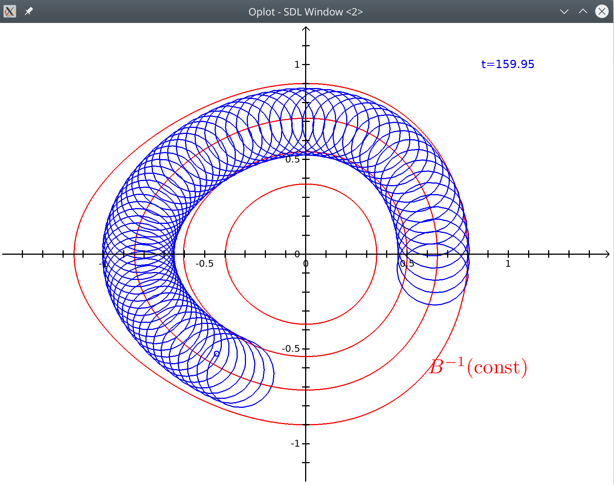

# Running the examples

(This requires `tsdl-ttf` version >= 0.4.)

Once the `oplot` library is installed, examples can be run in an ocaml
toplevel (for instance `utop`), or directly like this:

```
ocaml ./example.ml
```

Some of the examples make use of the `gsl` library.  Make sure your
system has the `libgsl` package and add the `ocaml` bindings with
`opam install gsl`.

`example.ml`:


`gamma.ml`:


`logistique.ml`:


`magnetic.ml`:


`matrix.ml`:


`surf3d.ml`:

